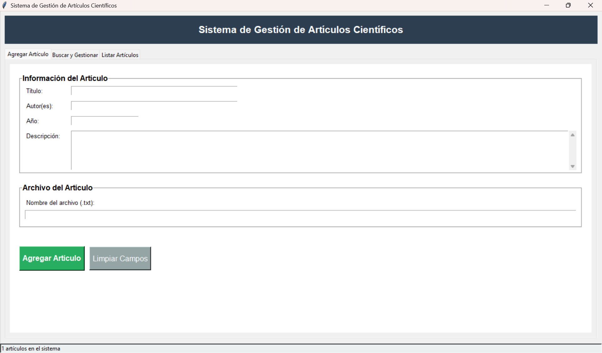
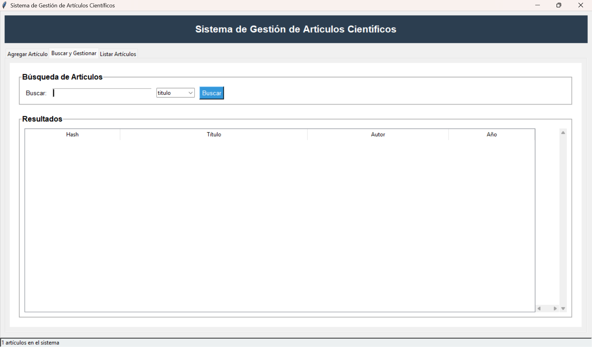
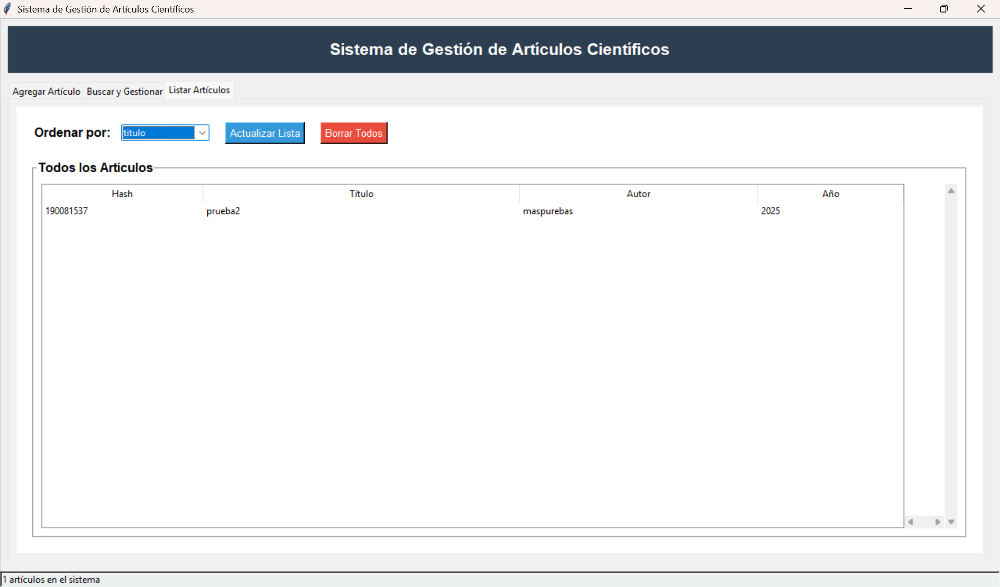

# Gestor de Artículos Científicos

**Descripción:** Programa que simula un gestor de artículos utilizando tablas hash, diseñado para el curso de Estructura de Datos II.

## Sistema de Gestión de Artículos

Al iniciar el programa, se presenta una ventana con múltiples opciones. La interfaz incluye una cinta de opciones con las siguientes funcionalidades:

1. **Agregar artículo**
2. **Buscar y gestionar**
3. **Listar artículos**

### Agregar Artículo

En esta sección, encontrarás un formulario para generar un nuevo artículo:

- **Título:** Ingrese el título del artículo.
- **Autores:** Ingrese el nombre del autor o los autores.
- **Año de publicación:** Añada el año en que se publicó el artículo.
- **Descripción:** Proporcione una breve descripción del artículo.

Además, hay un campo para agregar el artículo desde los archivos de la computadora o almacenamiento. (Se soportan archivos en formato PDF y .txt).

Para completar el proceso, presione el botón **"Agregar artículo"**. Si hay errores, puede utilizar el botón **"Limpiar campos"**.

### Buscar y Gestionar

Al acceder a esta sección, primero encontrará el apartado para buscar artículos, que se puede filtrar por:

- **Título**
- **Autores**
- **Año**
- **Hash**

Una vez delimitados los parámetros de búsqueda, presione el botón **"Buscar"** para realizar la acción. En la parte inferior, se muestra un área que devuelve los datos obtenidos de la búsqueda, junto con una barra de información que indica la cantidad de artículos encontrados.

### Listar Artículos

Esta sección permite listar los artículos de las siguientes maneras:

- Filtrar la búsqueda por:
  - **Título**
  - **Autores**
  - **Año**

Después de establecer los filtros, puede hacer clic en el botón **"Actualizar lista"** para visualizar los artículos. También hay una opción para **borrar todos** los artículos listados, junto con un cuadro que muestra la información devuelta y una barra que indica la cantidad de artículos encontrados.
# Gestor-Articulos-Cientificos
Programa que simula un gestor de artículos, haciendo uso de tablas hash, para el curso de estructura de datos II

El programa cuenta con una interfaz intuitiva la cual guiará al usuario a ejecutar las opciones que requiera.

## Opción 1: Agregar.
Para agregar un artículo, debe de indicarse el título del artículo, el autor del artículo y el año de publicación.

## Opción 2: Modificar.
Se indica el nombre del artículo para así modificar su información.

## Opción 3: Eliminar.
Se indica el nombre del artículo para eliminarlo de la base de datos.

## Opcion 4: Listar por autor.
Al usar esta opción se listan los artículos por autor, esto alfabéticamente.

## Opción 5: Listar por título.
Al usar esta opción, se listan los artículos por su título, esto alfabéticamente.

## Fuentes

- **Wikipedia**. (2025, 9 de agosto). [Hash table].
- **IBM**. (n.d.). [Tabla hash].
- **Microsoft**. (2024). [Todo lo que quería saber sobre las tablas hash].
- **W3Schools**. (n.d.). [Hash tables with Python].

## Integrantes

- German Juan Carlos Archila Batz - 1526824
- Pablo José Lorenzo Arrivillaga - 1530324
- Rodrigo Gabriel Pérez Vásquez - 1576224
- Crystian Antonio Velásquez Medrano - 1571424